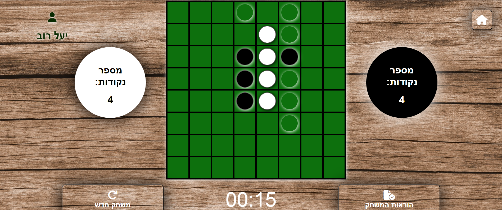

# Reversi Game

## Screenshots

### Main Page

*Caption: The main page of the Reversi game, featuring the login and registration options.*

### Game Board

*Caption: The Reversi game in action, showing the board layout and player pieces.*

## Project Description

This project is a web-based implementation of the classic Reversi (Othello) game, developed using pure JavaScript, HTML, and CSS. It showcases the maximum utilization of these languages' capabilities.

### Key Features:
- Player vs Computer gameplay
- Advanced AI opponent that calculates the most beneficial move each turn
- Significant difficulty level due to the computer's strategic play
- User registration and authentication system

## Background

This project was developed as my first product during the early stages of my computer science studies. It demonstrates my initial foray into web development and game programming.

## Technical Requirements

The project adheres to the following technical specifications:

- Developed using Visual Studio Code
- Collaborative development (pair programming)
- Organized file structure separating HTML, CSS, JS, and image files
- HTML features: tags, ids, classes, links, images, forms, buttons, events, functions
- CSS features: rules, position, display, flex, cursor, transition, animation, pseudo-classes
- JavaScript features: variables, arrays, functions, event listeners, timers, dates, forms, documentation

## Project Structure

1. **Landing Page**
   - Title and logo
   - Background design
   - Registration/Login form with various input fields

2. **User Authentication**
   - New user registration
   - Existing user identification
   - Password verification
   - Additional validations and notifications
   - Local Storage implementation for user data persistence

3. **Game Page**
   - Game title
   - Instructions
   - Game characters/pieces
   - Control buttons
   - Scoreboard
   - Timer

4. **Additional Features**
   - Utilization of images, audio, video, canvas, and score tracking

## Installation and Setup

To install and run the game:

1. Clone the repository.
2. Navigate to the project directory.
3. Open the `main.html` file in your web browser.
4. Sign up to create an account and start playing!

## How to Play

### Game Rules:

Reversi (also known as Othello) is a relatively simple game. It consists of an 8x8 square board and pieces with one black side and one white side. Each player has a color, and the goal of the game is to have more of your pieces on the board than your opponent's pieces.

### Gameplay:

1. At the start of the game, there are four pieces on the board, two white and two black.
2. You must try to capture your opponent's pieces and flip them to make them your color.
3. You do this by creating a horizontal, vertical, or diagonal line of pieces, where your pieces surround your opponent's pieces.
4. The surrounded opponent's pieces are captured and then flipped to your color, increasing the number of your pieces on the board.

Example: You have the black pieces. On the board, there's one black disc, next to it are 4 white pieces in a row. You place a black disc at the end of the row, now you have 4 white discs between 2 black discs, so these white discs turn black.

Every move you make must capture some of your opponent's pieces. This means that each time it's your turn, you must place one of your pieces next to a row of one or more opponent's pieces, with another of your pieces at the other end of the line. It sounds complicated, but we show you the available squares for moves with semi-transparent circles, so it's easy to learn the game once you start playing.

If one of the players has no valid move on the board that captures pieces, the game ends.

### Winning:

The game ends when the board is full, or when one of the players has no valid move. At that time, the pieces on the board are counted, and the player with more pieces wins.

## Technologies Used

- HTML5
- CSS3
- JavaScript (ES6+)

## Future Improvements

We are committed to enhancing the Reversi game experience. Here are some planned improvements for future versions:

1. Database Integration
   - Replace the current LocalStorage system with a real database
   - This will allow for more robust user data management and persistence
   - Enable features like user statistics, game history, and leaderboards

2. Mobile Responsiveness
   - Optimize the game interface for smartphone screens
   - Implement touch-friendly controls for mobile play
   - Ensure a seamless experience across various device sizes and orientations

3. Additional features we're considering:
   - Multiplayer mode for online matches against other players
   - Difficulty levels for the AI opponent
   - Customizable game board and piece designs

We welcome contributions and suggestions for these and other improvements!

## Contributors

- Yael Rov ([@YaelRov](https://github.com/YaelRov))
- Yoni Stern ([@Yoni4517](https://github.com/Yoni4517))

